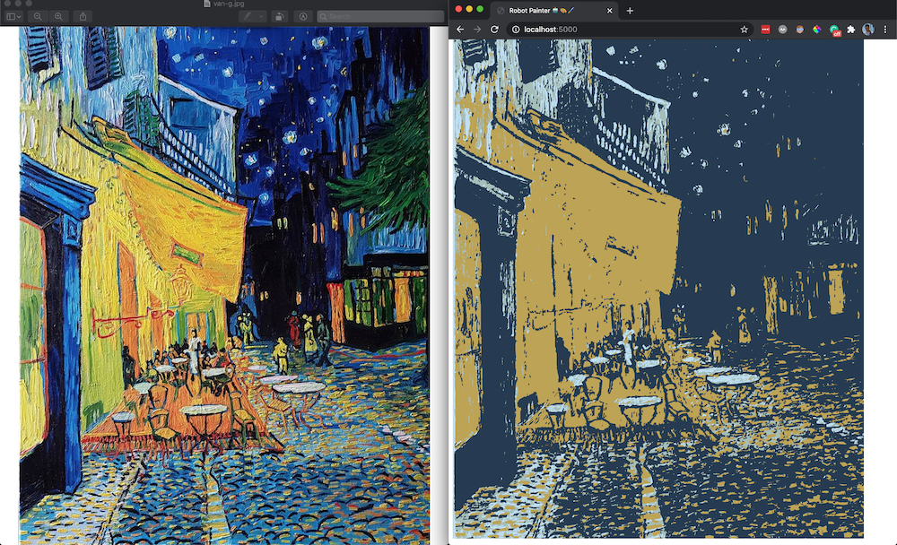

# robot-painter
I wanted to make something creative today, and for some reason, painting was the 1st thing that came to mind. But I didn't have any paint... so why not make a robot painter do it for me right? 🤖🎨🖌

The robot converts the paintings to an SVG file, which breaks them down into "lines". The drawn lines are funky, but the picture is still pretty well there. I started experimenting with having the robot paint those lines. Right now it's just using a pencil (flat line), so I found a paintbrush effect, but I'll have to re-do a lot of things by hand to make it use the right color and brush strokes.

I haven't done a fun project in a while, so it's been nice to go off and do something just because!

### Before and After

### Click on the image to watch it in action!

